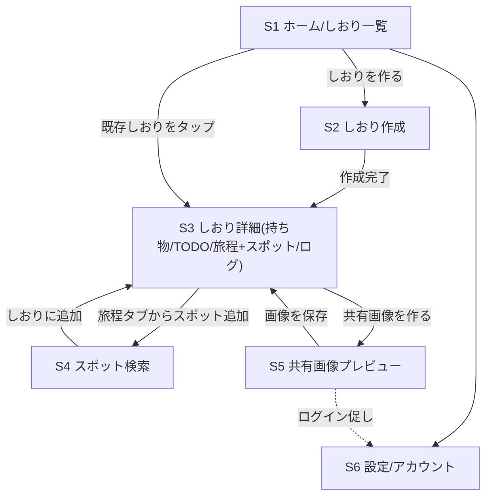

# 01. サービス仕様(MVP)

MVPは**3週間で公開**する。機能は最小限に絞り、テンプレート数・デザインバリエーションは最小構成で開始する。
週次マイルストーンは [02_roadmap.md](./02_roadmap.md) を参照。

## MVPの原則

1. **1人で使っても便利**(実用性ファースト)。共有・記録機能は最小限
2. **ゲストのまま全機能が試せる**。登録を求めるのは「クラウド保存・共有」のタイミングだけ
3. **スマホ最優先**。遠征中に片手で使える
4. 迷ったら削る。Phase 2以降に回す

## 用語

| 用語 | 意味 |
|------|------|
| しおり | 1回の遠征を表す単位。持ち物・TODO・旅程・スポット・ログを内包する |
| スポット | 行きたい/行った場所。聖地・会場・飲食店など |
| 運営シードスポット | 運営(オーナー+AIエージェント)が事前登録した公式スポットデータ |
| 遠征タイプ | しおりの種類: ライブ/イベント参戦・聖地巡礼・舞台/観劇・その他 |

## MVP機能一覧

### F1. しおり作成

- 入力項目: タイトル、日程(開始日〜終了日)、遠征タイプ、目的(イベント名・推し名は任意入力)、カバー色 or 絵文字
- 作成後は「しおり詳細」画面がホームになり、タブで各機能(持ち物/TODO/旅程/ログ)を切り替える(スポットは独立タブにせず旅程タブ内で扱う。2026-07-11オーナー決定)
- しおりは複数作成できる(一覧画面あり)

### F2. 持ち物リスト

- チェックボックス式。項目の追加・編集・削除・並べ替え(タップで完了)
- **テンプレート**: 遠征タイプを選ぶと定番アイテムがプリセットされる
  - 例(ライブ参戦): チケット/ペンライト/うちわ/推しタオル/トレカケース/モバイルバッテリー/双眼鏡/銀テ入れ
  - 例(聖地巡礼): モバイルバッテリー/カメラ/作品グッズ(撮影用)/歩きやすい靴/日焼け止め
- MVPでは各遠征タイプにつき1テンプレート(合計3〜4種)で開始

### F3. TODOリスト

- チェックボックス式+任意の期限日。期限が近い順に表示
- **テンプレート**: チケット申込/当落確認/チケット発券/ホテル予約/交通手配/遠征資金の準備 など
- 期限当日の表示強調のみ(プッシュ通知はMVP非対応)

### F4. 旅程

- 日ごとのタイムライン。エントリー = 時刻(任意)+タイトル+場所名(任意)+メモ(任意)
- 場所名にはGoogleマップ検索リンクを自動付与(APIキー不要の `https://www.google.com/maps/search/?api=1&query=URLエンコードされた場所名` 形式。場所名は必ず `encodeURIComponent` でURLエンコードする)
- エントリーの追加・編集・削除・並べ替え
- スポット(F5)から「旅程に追加」できる

### F5. 行きたいスポット

- **独立タブは持たず、旅程タブ(S3c)内のセクションとして表示する**(旅程と行きたい場所は使う場面が同じため1タブにまとめる。2026-07-11オーナー決定。画面内の構成はW2のUI設計で確定する)
- しおり内のスポットリスト。自由入力(名前+メモ)または**運営シードスポットから追加**
- 運営シードスポットは検索/一覧から選ぶ。データには「オタク文脈」(どの作品/メンバーゆかりか)の説明が付く
- MVP時点のシードデータは1特集分(ひなたフェス関連を想定)+主要会場程度の小規模で開始
- ユーザーの自由入力スポットは**そのしおり内だけの私的データ**(公開UGC化はPhase 2)

### F6. 写真とログ

- 遠征後(または最中)に、写真+ひとことメモを日付に紐付けて記録
- MVPでは1しおりあたり写真20枚まで(ストレージ無料枠保護のため。上限は環境変数などのシステム管理者側の設定でのみ変更可能とし、ユーザー設定では変更できない)
- 写真はアップロード時にクライアント側でリサイズ(長辺1600px程度)してから保存

### F7. 共有画像生成

- しおりの内容から**縦長(1080×1920)の共有画像**を生成し、端末に保存 → ユーザーが自分でX/Instagramに投稿する
- 画像に含む内容: しおりタイトル/日程/遠征タイプ/旅程ダイジェスト/持ち物・スポットの一部/写真(任意1〜3枚)
- **画像内にサービスロゴ+URLを必ず入れる**(UGC経由の流入動線の核)
- MVPではデザインテンプレート2種(シンプル/にぎやか)で開始
- X連携APIによる自動投稿はしない(画像保存→手動投稿。API費用と審査を回避)

### F8. アカウント(ゲスト→ログイン)

- **ゲスト利用**: 未ログインでも全機能が使える。データは端末(IndexedDB)に保存
- **ログイン**: X または Google OAuth(Supabase Auth)。ログインするとクラウド保存になり機種変更・複数端末に対応
- ログイン時、端末内のゲストデータをクラウドへ**マージ移行**する(詳細は [03_tech_stack.md](./03_tech_stack.md))
- ログインを促すタイミング: しおり保存後のバナー表示、共有画像生成後の一言、の2箇所のみ。しつこくしない

### F9. 広告枠

- 控えめなバナー広告枠を最初から画面レイアウトに確保しておく(しおり一覧下部・ログ画面下部の2箇所)
- AdSense審査に通るまでは自社告知(公式Xフォロー導線など)を表示
- 遠征当日に使う画面(旅程・持ち物チェック)には広告を置かない(実用性を損なわない)

### F10. PWA

- ホーム画面追加(manifest)、旅程・持ち物・TODOのオフライン閲覧(Service Worker キャッシュ)
- 遠征当日は電波が悪い会場でも持ち物・旅程が見えることを保証する

## 画面一覧

| # | 画面 | 主な内容 |
|---|------|----------|
| S1 | ランディング/ホーム | サービス説明+「しおりを作る」CTA。既存ユーザーにはしおり一覧 |
| S2 | しおり作成 | F1の入力フォーム(1画面で完結) |
| S3 | しおり詳細 | タブ切替: 持ち物(S3a)/TODO(S3b)/旅程+スポット(S3c)/ログ(S3d) ※スポットは旅程タブ内のセクション(2026-07-11オーナー決定) |
| S4 | スポット検索 | 運営シードスポットの検索・一覧・詳細→しおりに追加 |
| S5 | 共有画像プレビュー | テンプレ選択→プレビュー→画像保存 |
| S6 | 設定/アカウント | ログイン・ログアウト、データ移行状態、利用規約・プライバシーポリシー |

## 画面遷移

## 代表ユーザーフロー

### フロー1: 初遠征の準備(ゲスト)

1. 共有画像やSNSで知る → S1に到着 → 登録なしで「しおりを作る」
2. 遠征タイプ「ライブ参戦」を選ぶ → 持ち物・TODOテンプレが自動投入される
3. 旅程に新幹線・ホテル・開場時間を入れる → 当日はPWAでチェックリストを消化

### フロー2: 遠征後の共有

1. 遠征中〜帰宅後に写真とログを記録
2. 共有画像を生成して保存 → 自分のXに投稿(画像内のURLが新規ユーザーの入口になる)
3. 共有画像生成後にログイン促し → クラウド保存でしおりが資産化

## MVPで**やらないこと**(Phase 2以降)

- しおり・遠征レポの公開Webページ(URL共有・SEO) → Phase 2
- ユーザー投稿スポットの公開UGC化・モデレーション → Phase 2
- ひなたフェス特集(テンプレ・シードデータ拡充・キャンペーン) → Phase 2 ※MVPには最小限のシードのみ
- AI聖地巡礼ルート生成+クレジット課金 → Phase 3
- 参戦履歴・聖地コレクション(スタンプ帳的機能) → Phase 3
- 周遊MAP(ニアジョイ等) → Phase 3
- プッシュ通知、しおりの共同編集、ネイティブアプリ → 当面なし

## 非機能要件(MVP)

- スマホ(375px幅)基準のレスポンシブ。PCでも崩れない程度
- 主要画面の初回表示3秒以内(3G相当でも実用に耐える軽さ)
- 日本語のみ対応
- 利用規約・プライバシーポリシーを公開(AdSense審査要件でもある)
