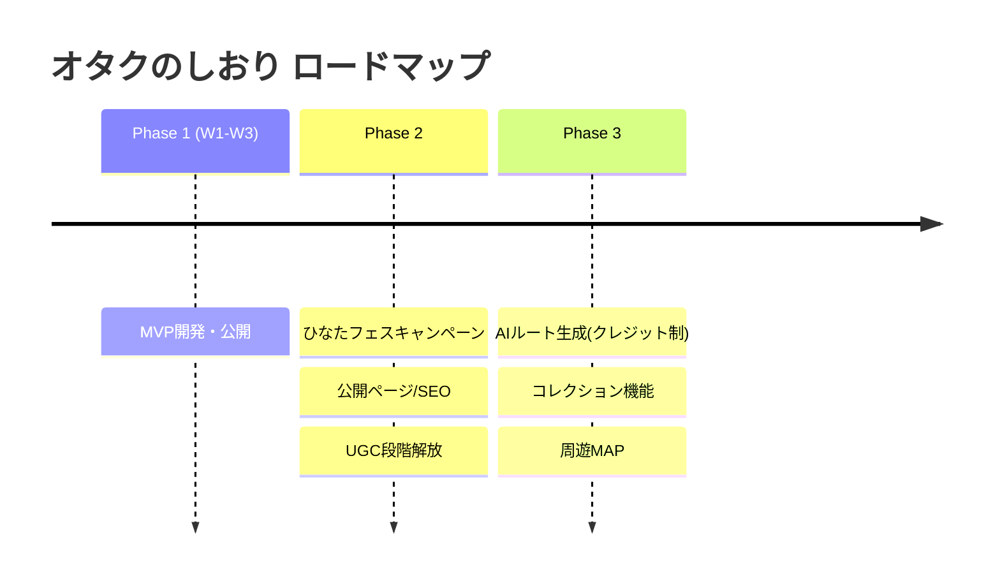

# 02. ロードマップ

3フェーズで進める。**Phase 1(MVP)は3週間で公開する。**

## Phase 1: MVPリリース(3週間)

ゴール: [01_service_spec.md](./01_service_spec.md) のMVPを一般公開し、初期ユーザーの声を拾える状態にする。

### 週次マイルストーン

| 週 | 完了条件 |
|----|----------|
| **W1: 基盤+コア作成体験** | プロジェクト基盤(Next.js+Supabase+CI+Netlifyデプロイ)/しおり作成(F1)/持ち物リスト(F2)/TODO(F3)がゲスト(端末保存)で動く |
| **W2: 遠征体験** | 旅程(F4)/スポット(F5、シードデータ最小投入)/写真とログ(F6)が動く ※共有画像生成(F7)は実装済みだが2026-07-29オーナー決定によりPhase 2送り。`FEATURE_SHARE`で導線を閉じている |
| **W3: 仕上げ+公開** | ログインとゲストデータ移行(F8)/PWA(F10)/広告枠(F9)/規約・ポリシー/LP文言/計測(アナリティクス)導入 → **公開** |

### 公開時に揃えるもの(開発以外)

- 独自ドメイン取得・接続
- 公式Xアカウント開設(AI下書き→オーナー承認の運用開始。→ [04_growth_monetization.md](./04_growth_monetization.md))
- Google Analytics(または無料のプライバシー配慮系計測)導入
- AdSense審査の申請準備(コンテンツ・規約ページが揃い次第申請)

### Phase 1 KPI(公開後4週間で計測)

- しおり作成数: 100冊
- 完成率(しおりに旅程または持ち物が1件以上入った割合): 計測できる状態にする

> **共有画像に関するKPI(生成数30枚・共有画像経由の流入)はPhase 2へ移した。** F7がPhase 2送りになり、
> ファーストリリースでは共有画像を作れないため。北極星の「完了」の代理指標を「共有画像生成あり」と
> するかは未確定(`docs/design/notes/2026-07-28_予算機能の検討.md` 判断事項3)。

## Phase 2: ひなたフェスキャンペーン+公開・UGC

ゴール: 特定セグメント(おひさま)に深く刺すキャンペーンで初期ユーザーの塊を作り、UGCと公開ページで流入ループを回す。
開始条件: MVP公開済み+ひなたフェス開催情報(日程・会場)の確定。開催時期から逆算してスケジュールを引く。

### 施策

1. **共有画像生成(F7)の開放**
   - Phase 1で実装済み。`src/lib/feature-flags.ts` の `FEATURE_SHARE` を `true` に戻すだけで、S3ヘッダーの共有アイコン・記録タブの共有導線カード・S5画面が復活する
   - 開放時のKPI: 共有画像生成数30枚 / 共有画像経由の流入を計測できる状態にする(Phase 1から移動)
2. **ひなたフェス特集**
   - ひなたフェス専用しおりテンプレート(持ち物・TODO・モデル旅程)
   - 会場周辺スポットDBの運営シード拡充(会場・周辺飲食・ゆかりの地。「Googleマップでは表現できない」オタク文脈の説明付き)
   - 特集ページ(LP)+公式Xでのキャンペーン投稿
   - おひさま勉強会など既存コミュニティとの連携・共同運営を見据えたPR(競争ではなく協力)
3. **公開遠征レポページ(SEO)**
   - しおり/遠征レポをユーザーが任意で公開URL化(OGP付き)
   - 「(イベント名) 遠征 持ち物」などの検索流入を狙うSEO基盤
4. **UGCスポット投稿の段階解放**
   - ユーザーの私的スポット → 「公開申請」→ 運営(AIモデレーション+オーナー確認)承認で公開DBへ
   - 品質担保のため段階解放。荒らし・重複・権利問題をモデレーションガイドラインで防ぐ

### Phase 2 KPI

- キャンペーン期間中のしおり作成数(ひなたフェステンプレ利用数)
- 公開ページのPV・検索流入数
- 共有画像生成数: 30枚(Phase 1から移動。F7開放後に計測)
- 共有画像経由の流入: 計測できる状態にする(Phase 1から移動)
- UGCスポット投稿数・承認率
- AdSense収益の発生(金額よりまず「収益が出る構造の完成」)

## Phase 3: AIルート生成・コレクション・周遊MAP

ゴール: 「遠征の強力なパートナー」への進化と、クレジット課金による収益の柱を追加する。

### 施策

1. **AI聖地巡礼ルート生成(クレジット制)**
   - 行きたいスポット+日程+出発地から、巡る順番・移動手段・所要時間込みのルート案を生成
   - 無料枠(例: 月3回)+クレジット購入(Stripe)。生成結果はしおりの旅程に反映できる
2. **参戦履歴・聖地コレクション**(収集癖に応える)
   - 行った聖地・参戦したライブがコレクション(スタンプ帳)として貯まる
   - 年間まとめ画像(「今年の遠征まとめ」)で共有ループを強化
3. **周遊MAP**
   - 各地の聖地を面で見せる周遊MAP(第1弾候補: ニアジョイ聖地・観光周遊MAP)
   - UGCで育ったスポットDBの見せ方の進化形

### Phase 3 KPI

- クレジット課金の転換率・収益
- コレクション機能利用者の継続率(2回目以降のしおり作成率)

## 各フェーズの継続/撤退判断

- 各フェーズKPIをフェーズ末にレビューし、**続行/方向転換/縮小**をオーナーが判断する
- 判断材料はアナリティクス/グロースエージェントがレポートとして毎週まとめる(→ [05_agent_team.md](./05_agent_team.md))
- 撤退ラインの例: Phase 1公開後8週間でしおり作成数が2桁に届かない場合、ターゲット・訴求の再設計に立ち戻る(機能追加で解決しようとしない)
