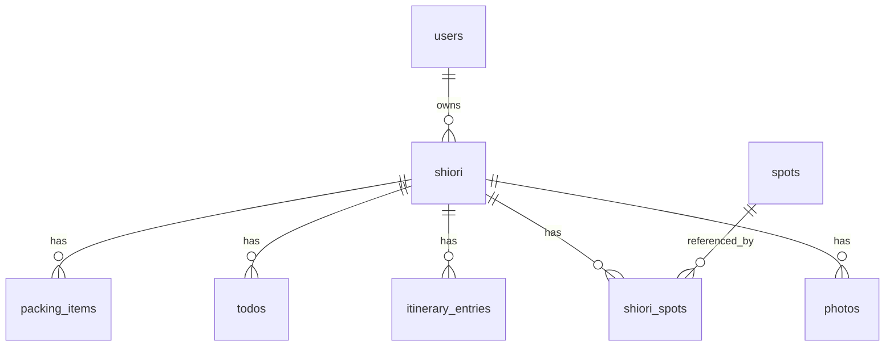

# 03. 技術選定

前提: ランニングコストは**月0〜数千円**(無料枠中心)。3週間でMVPを出せるシンプルさを最優先。
AIエージェントが実装しやすいよう、広く使われた定番構成のみを採用する。

## スタック一覧

| レイヤー | 採用 | 理由 |
|----------|------|------|
| フレームワーク | **Next.js (App Router) + TypeScript** | 情報量・エージェントの実装精度が高い |
| UI | **Tailwind CSS** | スマホ最優先のUIを速く作れる。デザイントークンを一元管理 |
| ホスティング | **Netlify(Free/無料枠)** | 無料プランで商用利用・広告掲載が明示的に可。Next.js SSR・Node関数対応でスタック変更不要(選定経緯を下記) |
| BaaS | **Supabase(無料枠)** | Auth(X/Google OAuth)+Postgres+Storageが1つで揃う |
| ゲスト保存 | **IndexedDB(ラッパーとして idb など軽量ライブラリ)** | localStorageの5MB制限を回避し写真ログにも対応 |
| 共有画像生成 | **satori + resvg によるサーバー生成(Netlify Functions=Node関数上で実行)** | HTML/CSSライクにテンプレを書けてエージェントが保守しやすい。1080×1920縦長 |
| 画像リサイズ | クライアント側(Canvas)で長辺1600pxに縮小してからアップロード。**加えてSupabase Storageのバケット設定でMax File Size(2MB以下)と許可MIMEタイプ(image/jpeg, image/webp等)を必ず制限する**(クライアント処理のバイパス対策=多層防御) | Storage無料枠(1GB)の保護 |
| 地図リンク | GoogleマップのURLスキーム(`https://www.google.com/maps/search/?api=1&query=...`) | APIキー不要・無料。地図SDKはMVPでは使わない |
| 計測 | Google Analytics 4(または Cloudflare Web Analytics) | 無料。共有画像経由流入はURLパラメータ(`?via=share`)で識別 |
| 広告 | Google AdSense | 審査通過後に有効化。枠はレイアウトに最初から確保 |
| CI/CD | GitHub Actions(lint+型チェック+テスト)→ Netlify自動デプロイ | エージェント開発の品質ゲート |
| 課金(Phase 3) | Stripe | クレジット制課金。MVPでは導入しない |

### ホスティング選定の経緯(2026-07-09 オーナー決定)

当初はVercel(Hobby)を想定していたが、実装開始前にNetlifyへ変更した。理由:

- **Vercel Hobbyは非商用限定**で、広告(AdSense)掲載の扱いがグレー(Fair Use Guidelinesと プラン規約で解釈が割れる)。広告収益を前提とする本サービスには規約リスクがある
- **Cloudflare Workers無料プランはCPU時間10ms/リクエスト制限**があり、satori+resvgによる1080×1920画像生成(F7)がほぼ確実に超過する。回避にはWorkers Paid($5/月)か共有画像のクライアント生成への仕様変更が必要
- **Netlify Freeは商用利用・広告掲載が明示的に可**で、Next.js SSR・Node関数(satori+resvgがそのまま動く)に対応。仕様変更ゼロで移行できる

Netlify無料枠の天井: 帯域100GB/月・関数呼び出し125k回/月・ビルド300分/月。重い写真データはSupabase Storage側に載るため、MVP〜Phase 2規模では十分。超過が見えたらNetlify Pro($19/月)かCloudflare(有料)への移行をオーナーが判断する。

## データモデル草案



| テーブル | 主なカラム |
|----------|-----------|
| `users` | id, auth_provider, display_name, created_at(Supabase Authに準拠) |
| `shiori` | id, user_id(NOT NULL・`users` への外部キー), title, start_date, end_date, trip_type(live/seichi/stage/other), purpose, cover, created_at, updated_at ※ゲストデータは端末内のみに存在し、クラウドにはログイン後の移行時に必ず `user_id` 付きでINSERTされる |
| `packing_items` | id, shiori_id, label, is_checked, sort_order |
| `todos` | id, shiori_id, label, due_date, is_done, sort_order |
| `itinerary_entries` | id, shiori_id, day_date, time, title, place_name, memo, sort_order |
| `spots` | id, name, description(オタク文脈), category, area, source(seed/ugc), status(private/pending/public), created_by |
| `shiori_spots` | shiori_id, spot_id, memo(しおり内メモ), is_visited |
| `photos` | id, shiori_id, day_date, storage_path, caption, created_at |

設計メモ:

- ユーザー自由入力スポットも `spots` に `source=ugc, status=private` で入れる(Phase 2の公開申請フローで `pending → public` に遷移できる形にしておく)
- テンプレート(持ち物・TODO)はMVPでは**コード内の定数**(JSON)でよい。DB化はテンプレが増えるPhase 2で検討
- Supabase RLS(Row Level Security)を**全テーブルに**設定する。「自分のしおりだけ読み書き可」に加え、子テーブル(`packing_items` / `todos` / `itinerary_entries` / `photos` / `shiori_spots`)にも親 `shiori.user_id` を参照するポリシー(`EXISTS` 句)を必ず適用する(`shiori_id` を知る第三者の不正読み書きを防ぐ)。`spots` は `status=public` または `source=seed` のみ全員読み取り可

## ゲスト → ログインのデータ移行

1. ゲストのしおり一式はIndexedDBに、サーバーと同じスキーマ形状(JSON)で保存する(写真はバイナリ=BlobとしてIndexedDBに保存)
2. ログイン成功時、端末内の全しおり(テキストデータ)をAPIに送信 → サーバー側で `user_id` を付けて一括INSERT
3. 続いて写真バイナリを1枚ずつSupabase Storageへアップロードし、返ってきた `storage_path` を対応する `photos` レコードに紐付けて登録する(枚数が多い場合に備え、進捗表示+失敗分のみ再送できる実装にする)
4. テキスト+写真の全件成功後にIndexedDB側へ「移行済み」フラグを付け、以後はクラウドを正とする
5. 衝突は考えない(ゲストデータは新規INSERTのみ。同一ユーザーの複数端末ゲストデータもそれぞれ別しおりとして追加)
6. 移行失敗時はゲストデータを消さずリトライ可能にする(端末データを消すのは移行成功後のみ)

## 月額コスト見積り

| 項目 | MVP期 | 成長期の目安 |
|------|-------|--------------|
| Netlify | 0円 | Pro $19/月 or Cloudflare(有料)へ移行を判断 |
| Supabase | 0円 | Pro $25/月(DB 500MB/Storage 1GB超過時) |
| ドメイン | 約150円/月(年1,500〜2,000円) | 同左 |
| GA4/AdSense | 0円 | 0円 |
| AI API(SNS下書き等) | 0円〜数百円(このリポジトリのエージェント運用内で完結させる) | ルート生成開始後は従量。クレジット課金で回収 |
| **合計** | **約150円〜数百円/月** | 収益に応じて段階増 |

## リポジトリ構成(実装開始時の指針)

```
otaku_no_shiori/
├── docs/                  # 本仕様書群(常に最新を維持)
├── src/
│   ├── app/               # Next.js App Router(画面: S1〜S6)
│   ├── components/
│   ├── lib/               # supabaseクライアント, ゲスト保存(IndexedDB), 移行ロジック
│   ├── templates/         # 持ち物・TODOテンプレ(JSON定数)、共有画像テンプレ
│   └── types/
├── supabase/              # マイグレーションSQL, RLSポリシー
├── seeds/                 # 運営シードスポットのデータ(JSON/CSV)
└── .claude/               # エージェント定義・スキル(→ docs/05_agent_team.md)
```

## 品質ゲート(CI)

- `lint`(ESLint)+ `tsc --noEmit` + ユニットテスト(Vitest)をGitHub Actionsで必須化
- E2Eは主要フロー1本(しおり作成→持ち物チェック→共有画像生成)をPlaywrightでW3に追加
- mainブランチ直pushは禁止。全変更はPR経由(コードレビュアーエージェントが必ずレビュー)
