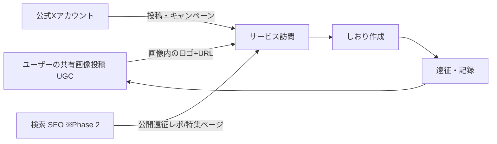

# 04. 集客・収益化

前提: オーナーはコードを書かない。流入動線づくり・SNS集客もAIエージェントが主導し、
オーナーは**承認と投稿**だけを行う(→ 体制は [05_agent_team.md](./05_agent_team.md))。

## 流入動線の全体像

**主動線はUGCループ**: 便利に使う → 共有画像を投稿 → 画像を見た人が訪問 → しおり作成 → また共有。
公式XとSEOはこのループの着火剤・補助輪と位置づける。

## 1. UGC(共有画像)— 主動線

- 共有画像には**必ずサービスロゴ+URLを入れる**(F7の仕様)
- 流入計測: 画像に載せるURLは `?via=share` 付きの短いパスにして、GA4で共有経由を識別
- デザイン改善はデータ駆動: 「生成された画像テンプレ別の流入数」を毎週レビューし、テンプレを改廃
- Phase 2でハッシュタグ(例: `#オタクのしおり`)を画像に標準挿入し、X上での検索性を作る

## 2. 公式Xアカウント運用 — AI下書き→オーナー承認投稿

- **フロー**:
  1. SNS運用エージェントが週1回、翌週分の投稿カレンダー(投稿案+画像+推奨投稿時刻)を生成
  2. オーナーが確認し、修正指示 or そのまま各投稿をワンタップでコピー&投稿
  3. エージェントは反応(インプレ・プロフィールクリック)の週次レポートを作り、翌週の案に反映
- **自動投稿はしない**(X APIの費用・凍結リスク・bot感による反感を回避)
- **投稿の型**(初期の3本柱):
  - 機能・使い方紹介(しおりのスクショ+1機能ずつ)
  - 遠征お役立ちコンテンツ(持ち物チェックリスト画像・遠征段取り術。保存・RTされやすい)
  - イベント連動(ひなたフェス等の話題に合わせた特集告知)
- **トーン**: 遠征仲間のような温度感。宣伝一辺倒にしない。オタク文化への敬意を最優先し、
  推し・運営・会場への言及は事実ベースで慎重に(権利・肖像に触れる画像は使わない)

## 3. SEO(Phase 2〜)

- 公開遠征レポページ・特集ページで「(イベント名) 遠征 持ち物」「(会場名) 周辺 ごはん」等の検索需要を取る
- MVP期はLP1枚のみでSEOは深追いしない(その分UGCループの完成度に投資)

## 4. ひなたフェスキャンペーン(Phase 2のPR施策)

1. 開催情報確定後すぐ: 特集テンプレ+会場周辺スポット特集を公開
2. 公式Xで「ひなたフェス遠征のしおり、これで作れます」訴求(持ち物テンプレ画像が拡散の核)
3. おひさま勉強会等の既存コミュニティへ**協力ベース**で声かけ(共同運営を見据える。競争しない)
4. フェス当日〜直後: 「遠征おつかれさま」投稿で共有画像生成を促す(UGCの収穫期)
5. 結果をレポート化し、次のイベント(他グループ・他ジャンル)へ横展開するかを判断

## 収益化

### 段階戦略

| 段階 | 手段 | 時期 | 備考 |
|------|------|------|------|
| 1 | **AdSenseバナー広告** | MVP公開後、審査通過次第 | 広告枠はF9の2箇所。実用画面には置かない |
| 2 | **AIルート生成のクレジット課金** | Phase 3 | 無料枠(月3回想定)+クレジット購入(Stripe)。原価=AI API費を回収できる単価に設定 |
| 3 | (検討)**旅行系アフィリエイト** | Phase 2以降に判断 | ホテル・交通のASP。旅程機能と相性は良いが、導線設計と審査の手間があるため優先度は低め |

### AdSense審査準備チェックリスト(W3までに完了)

- [ ] 独自ドメイン
- [ ] 利用規約・プライバシーポリシー(広告Cookie・GA4利用の明記)
- [ ] 運営者情報・お問い合わせ手段
- [ ] LP+使い方説明などテキストコンテンツが十分にあること(ツール単体ページだと落ちやすい。使い方ガイド数ページを用意)
- [ ] 公開後、実ユーザーのアクセスが発生してから申請

### 収益の考え方

- MVP期の目標は金額ではなく「**収益が発生する構造の完成**」(広告表示+計測が回っている状態)
- クレジット課金開始後は「AI API原価 < クレジット売上」を維持するのが最低ライン
- 月次でコスト([03_tech_stack.md](./03_tech_stack.md) 見積り)と収益をレポートし、黒字化ラインをオーナーが把握できるようにする
