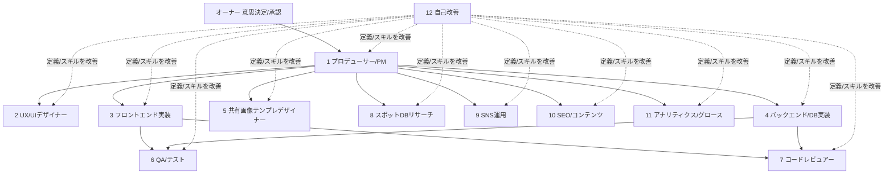

# 05. AI自律開発体制

前提: **オーナーはコードを一切書かない**。開発・運用・集客はAIエージェントチームが行い、
オーナーは「意思決定・承認・SNS投稿の実行」だけを担う。
本ドキュメントで体制を確定し、実際の定義ファイルは `.claude/agents/`・`.claude/skills/` に作成済み(下の「定義ファイル一覧」参照)。共通ルールはリポジトリ直下の `CLAUDE.md` にある。

## 体制図(12エージェント+拡張2)



## エージェント定義一覧

| # | エージェント | 役割 | 主な成果物 | 稼働タイミング |
|---|--------------|------|------------|----------------|
| 1 | **プロデューサー/PM** | docs/の仕様とKPIに基づき、週次計画・タスク分解・優先度決定。他エージェントへの指示書を書く | 週次計画、Issue/タスクリスト、意思決定が必要な事項のオーナー向けサマリ | 週初+随時 |
| 2 | **UX/UIデザイナー** | 画面設計・コンポーネント設計・デザイントークン(色・余白・タイポ)の管理 | 画面仕様(テキスト+構造)、Tailwindトークン定義 | 機能着手前 |
| 3 | **フロントエンド実装** | Next.js/TypeScript/Tailwindで画面・PWA・ゲスト保存を実装 | PR(実装+ユニットテスト付き) | 毎日 |
| 4 | **バックエンド/DB実装** | Supabaseスキーマ・RLS・API・認証・データ移行を実装 | PR(マイグレーションSQL+テスト付き) | 毎日 |
| 5 | **共有画像テンプレデザイナー** | satoriベースの共有画像テンプレの新規作成・改善 | テンプレコード+サンプル出力画像 | W2以降、以後は流入データに応じ改廃 |
| 6 | **QA/テスト** | 受け入れ観点の作成、E2E(Playwright)整備、リリース前チェック | テストコード、バグレポート、リリース判定チェックリスト | PRごと+リリース前 |
| 7 | **コードレビュアー** | 全PRのレビュー(正しさ・セキュリティ・RLS漏れ・無料枠保護) | レビューコメント、承認/差し戻し | PRごと |
| 8 | **スポットDBリサーチ** | 運営シードスポットの調査・作成(オタク文脈の説明文付き)。出典を必ず記録 | `seeds/` のスポットデータ+出典リスト | W2、Phase 2で拡充 |
| 9 | **SNS運用** | 投稿カレンダー・投稿文・添付画像案の下書き生成、反応の週次レポート | 週次投稿カレンダー(オーナー承認用) | 週1+イベント時 |
| 10 | **SEO/コンテンツ** | LP・使い方ガイド・規約/ポリシー文面、Phase 2の公開ページSEO設計 | ページ原稿、メタ情報、AdSense審査対応チェック | W3、Phase 2で本格化 |
| 11 | **アナリティクス/グロース** | GA4データの週次レポート、KPI進捗、テンプレ別流入分析、改善提案 | 週次グロースレポート(KPIと提案3つ以内) | 週1 |
| 12 | **自己改善** | 各エージェントの出力品質を監査し、エージェント定義・スキルの文面を改善 | `.claude/` 配下の改善PR、改善ログ | 週1 |

### 拡張(必要になったら追加)

| # | エージェント | 追加タイミング |
|---|--------------|----------------|
| 13 | **法務/規約・プライバシー** | UGC公開(Phase 2)・課金(Phase 3)開始前に、規約改定・権利リスクレビューを担当 |
| 14 | **広告/収益化オペレーション** | AdSense審査通過後。広告配置の最適化・収益レポート・クレジット課金設計を担当 |

### 定義ファイル一覧(作成済み)

| # | エージェント | 定義ファイル |
|---|--------------|--------------|
| 1 | プロデューサー/PM | `.claude/agents/pm-producer.md` |
| 2 | UX/UIデザイナー | `.claude/agents/ux-ui-designer.md` |
| 3 | フロントエンド実装 | `.claude/agents/frontend-dev.md` |
| 4 | バックエンド/DB実装 | `.claude/agents/backend-dev.md` |
| 5 | 共有画像テンプレデザイナー | `.claude/agents/share-image-designer.md` |
| 6 | QA/テスト | `.claude/agents/qa-tester.md` |
| 7 | コードレビュアー | `.claude/agents/code-reviewer.md` |
| 8 | スポットDBリサーチ | `.claude/agents/spot-researcher.md` |
| 9 | SNS運用 | `.claude/agents/sns-writer.md` |
| 10 | SEO/コンテンツ | `.claude/agents/seo-content.md` |
| 11 | アナリティクス/グロース | `.claude/agents/analytics-growth.md` |
| 12 | 自己改善 | `.claude/agents/self-improver.md` |

スキルは `.claude/skills/<名前>/SKILL.md` に6種(`sns-draft` / `spec-sync` / `weekly-report` / `release-check` / `seed-spot` / `self-improve`)を作成済み。拡張エージェント(13・14)は追加タイミングが来たら同じライティング規約で作成する。

## タスク実行プロトコル(全エージェント・全タスク必須)

全文は `CLAUDE.md`、ログテンプレートは `docs/logs/work/README.md` にある。4つの柱:

| # | ルール | 実行方法 |
|---|--------|----------|
| 1 | **Goalを設けて動く** | 作業前にGoalを1行で書く。Goalが決められないなら着手せず報告 |
| 2 | **出来ていない点を必ず報告** | 完了報告の「できていないこと」行は省略禁止。無い場合も「なし」と明記 |
| 3 | **不明点を必ず報告** | 途中で出た不明点は止まって報告。仮置きで進めたら完了報告に明記 |
| 4 | **作業ログを必ず残す** | `docs/logs/work/YYYY-MM-DD_<エージェント名>.md` に完了報告と同じ内容を追記 |

確実に実行させる仕組み(3層):

1. **定義への埋め込み**: 全エージェント定義の末尾に同一の「タスク実行プロトコル」節がある(サブエージェント起動時も定義単体で読まれる)
2. **フォーマット強制**: 完了報告は6項目固定。「なし」の明記を必須にして、無言の省略をフォーマット違反として検出可能にする
3. **相互チェック**: code-reviewerの観点表・qa-testerの手順・self-improverの監査に「完了報告と作業ログの有無」の確認が入っており、省略は差し戻される

## 週次の回し方(定常運用)

1. **週初**: PMが先週のグロースレポート(#11)とdocs/ロードマップを見て週次計画を作成 → オーナーが承認
2. **平日**: 実装系(#2〜#5)がタスクを消化。PRごとに #6 QA と #7 レビュアーが品質ゲート
3. **週1**: #9 SNS運用が翌週の投稿カレンダーを提出 → オーナーが承認・投稿
4. **週末**: #11 が週次レポート、#12 が自己改善PRを提出
5. **オーナーの関与は「承認・投稿・意思決定」のみ**。判断が必要な事項はPMが選択肢+推奨付きでまとめる

## エージェント定義・スキルのライティング規約

**目的: Sonnet/Opusクラスのモデルで動かしても安定して良い出力になる定義を書く。**
`.claude/agents/*.md` と `.claude/skills/*` は全て以下の規約に従う。

1. **短い文で書く**。1文1指示。複文や「〜しつつ〜する」を避ける
2. **手順は番号付きリスト**で明示する。「適切に」「いい感じに」等の曖昧語を使わない
3. **入力と出力の例を必ず1つ以上載せる**(入出力例があるだけで小型モデルの精度が大きく上がる)
4. **やらないことを明記する**(例: 「このエージェントはコードを書かない」「mainに直接pushしない」)
5. **判断基準は表かチェックリスト**にする(例: レビュー観点、リリース判定)
6. **参照先を固定する**: 仕様は必ず `docs/` の該当ファイルを読むよう指示し、記憶で判断させない
7. **出力フォーマットを固定する**(見出し構成・ファイルパス・命名規則を定義内に書く)
8. 定義の冒頭に「役割の1行要約」「成果物」「完了条件」の3点を必ず書く

### 定義テンプレート(全エージェント共通の骨格)

```markdown
---
name: (エージェント名)
description: (1行要約。いつ起動するか)
---

# 役割
(1行要約)

# 成果物
- (何をどこに出すか。ファイルパス・形式まで固定)

# 完了条件
- (これを満たしたら終了、のチェックリスト)

# 手順
1. docs/XX を読む
2. ...

# やらないこと
- ...

# 出力例
(入力例 → 出力例を最低1組)
```

## スキル(スラッシュコマンド)設計

| スキル | 内容 | 主な利用者 |
|--------|------|-----------|
| `/sns-draft` | docs/04の投稿の型に沿って、翌週分の投稿カレンダー+投稿文案を生成する | SNS運用(#9)、オーナー |
| `/spec-sync` | 実装とdocs/の差分を検出し、docs更新PRを作る(仕様書を常に最新に保つ) | PM(#1)、自己改善(#12) |
| `/weekly-report` | GA4・KPI・コストを集計して週次グロースレポートを生成する | アナリティクス(#11) |
| `/release-check` | リリース判定チェックリスト(QA・規約・計測・広告枠)を実行する | QA(#6) |
| `/seed-spot` | スポット調査→`seeds/`形式のデータ+出典リストを生成する | スポットDBリサーチ(#8) |
| `/self-improve` | 直近の各エージェント出力を監査し、定義・スキルの改善PRを作る | 自己改善(#12) |

スキルも上記ライティング規約に従って書く(特に入出力例と出力フォーマット固定)。

## 自己改善(#12)の運用ルール

1. 週1回、直近の全エージェント成果物(PR・レポート・下書き)をサンプリングして品質を採点する
2. 出力が規約や仕様からズレたケースを特定し、**原因を定義文の欠陥として言語化**する
3. エージェント定義/スキルの修正PRを作る(1回の改善PRは3ファイル以内。小さく直す)
4. 改善ログ(`docs/logs/self_improve/`)に「何を・なぜ・どう直したか」を残す
5. エージェントの追加・削除・役割変更は自己改善エージェントの独断では行わず、PM経由でオーナー承認を取る

## オーナーへのエスカレーション基準

以下は必ずオーナーの判断を仰ぐ(エージェントが独断しない):

- お金に関わること(有料プラン移行、課金設計、広告配置の大幅変更)
- 対外的なこと(SNS投稿の実行、コミュニティ・外部団体への連絡、キャンペーン開始)
- 権利・法務リスク(画像・名称の利用、規約変更)
- ロードマップの変更(フェーズの入れ替え・機能の大幅追加削除)
